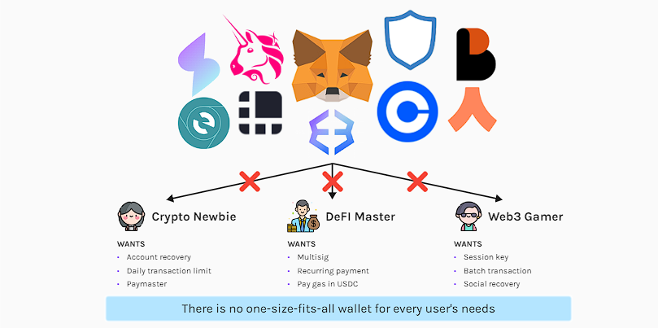
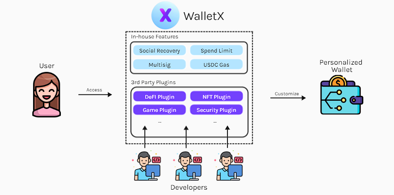

# WalletX
WalletX, the ultimate wallet solution that is designed to cater to everyone's unique needs.

In the WalletX platform, we offer a variety of in-house features that users can select from. However, what sets WalletX apart from other wallets is that it allows external developers to upload plugins to our platform, providing users with even more options to choose from. 

With WalletX, users can build and customize their wallets, creating a personalized experience that is tailored to their specific requirements.

## Table of Contents
* [Background](#background)
* [Problem Statement](#problem-statement)
* [Our Solution](#our-solution)
* [Walkthrough](#walkthrough-our-repos)

## Background
In the current crypto landscape, there are numerous wallets available such as Metamask, Trust Wallet, and ArgentX, each offering distinct functionalities. However, given the diverse user profiles in the crypto space, these wallets are unable to cater to every user's needs. 

Some users may require features such as account recovery, daily transaction limits, and paymasters, while others may require features such as multisig, recurring payments, and gas payments in USDC for Defi purposes. As a result, users are forced to create multiple wallets to meet their requirements, which can hinder user experience and create barriers to web3 adoption.

## Problem Statement
These limitations affect the accessibility of crypto, especially for those who require customized wallet solutions. With EOA, it is not possible to address these limitations, and even with AA wallets, each has its own functionalities that users must make choice between them or lacking flexibility of customization.

## Our Solution
WalletX is a plugins marketplace for AA wallet features that addresses these limitations and empowers users to have a more tailored and personalized wallet experience.

Users will able to pick any amount of plugins available on our platform and creating personalised wallet relevant to their use case.

Creation of features are also decentralised and accessible to everyone. Developers able to create plugins with any kind of logics they can think of and list them on WalletX.

## Technologies

## Walkthrough our Repos
[WalletX Extension](https://github.com/scale-eth-team-x/trampoline)

[Contract factory UI](https://github.com/scale-eth-team-x/factory-deployer-ui)

[Contract factory](https://github.com/scale-eth-team-x/factory-aggregator)

[Plugins contracts](https://github.com/scale-eth-team-x/eth-smart-contracts)
